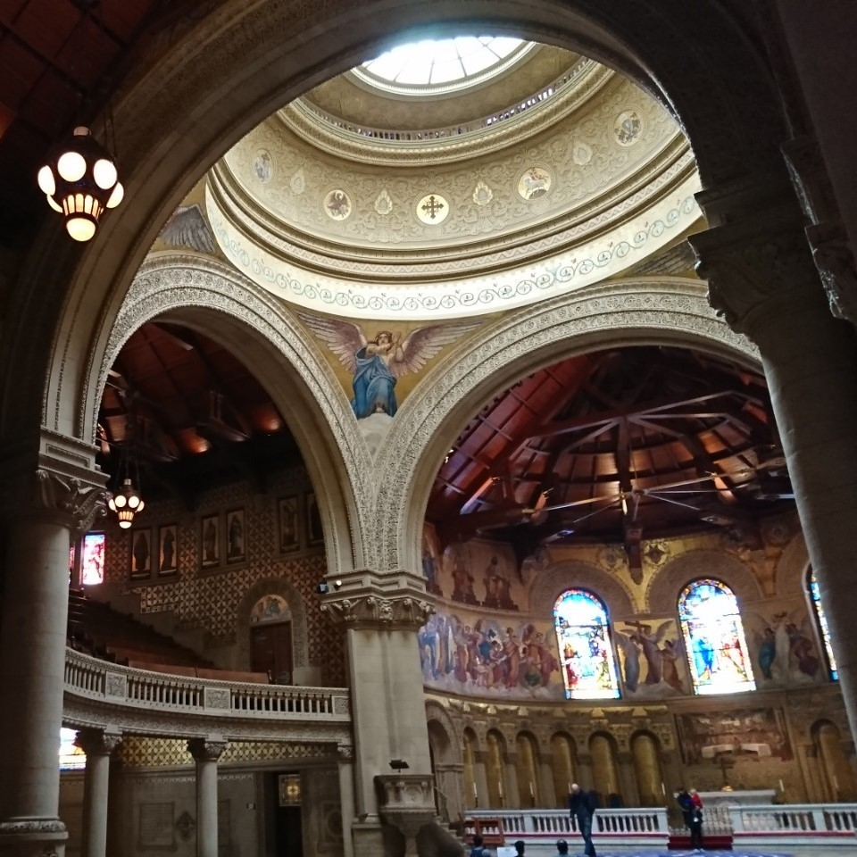

<!--
headingDivider: 2
-->

<!--
class: slides
-->

# XXXのはじめかた


<!--
_class: title
-->

### @hijiki51

#  @hijiki51

<!--
_class: user
-->

- 理学院物理学系3年
- SysAd/Game/CTF/(Sound)
- バックエンドやインフラが好きです
- 数学ゴリゴリのロジック書きたいこの頃


## 大学で何をしたいですか？

<!--
_class: subtitle
-->
## やりたいこと

- 専攻分野の研究
- 運動
- 音楽
- お絵描き
- ものづくり
- 数学
- etc... 


## コミュニティに所属する

<!--
_class: subtitle
-->
## コミュニティ

- 専攻分野の研究
  - 研究室に行ってみる
  - 大学の精度を利用する
    - B2D(Bachelor to Doctor)
- 運動/音楽
  - サークルに所属する
  - 市民団体に参加してみる
- お絵描き/ものづくり
  - TwitterなどのSNSに投稿してみる
  - etc...

## さわりだけやってみたい

<!--
_class: subtitle
-->
## 体験会

- SysAd体験会
- サウンド体験会
- CPCTF(競プロとCTFの体験会)
- グラフィック体験会
- ロゴデザイン体験会
- 3DCG体験会
- プログラミング体験会

## 思い立ったが吉日

<!--
_class: subtitle
-->

## 今回話す内容

- プログラミング
- CTF
- DTM

## プログラミング

- 

## CTF

## DTM

## いろいろ

多分だいたいのMarkdown記法に対応してるよ

```javascript
console.log("おいす～")
```
> は?情緒不安定か?ﾏﾝｺﾞｰうまいぜ

$$
a+b=c
$$

## いろいろ2

| a            | b        |
| ------------ | -------- |
| あ           | い       |
| こんな感じで | 書けるよ |


## 画像

あんまり凝ったことはできない


サイズ変えたり横に並べるぐらいならできる


